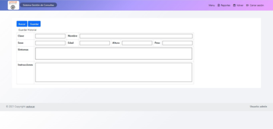

# Hospital Proyecto

Este es un sistema de tipo hospital que permite la gestión de clientes, doctores y administradores. Proporciona una interfaz intuitiva para gestionar citas médicas, realizar consultas y revisar la disponibilidad de personal.

## Funcionalidades

- **Gestión de Citas Médicas**: Permite la creación, modificación y eliminación de citas.
- **Consultas Médicas**: Proporciona un sistema para realizar y documentar consultas.
- **Administración de Personal y Clientes**: Gestión de usuarios, incluyendo roles de doctores, administradores y pacientes.

## 


> Dashboard para el personal


> Agendar Cita


> Imprecion de Datos


> Reseta Medica Digial

## Tecnologías Utilizadas

- Frontend: HTML, CSS, JavaScript
- Backend: Node.js, Express
- Base de Datos: MongoDB / MySQL

## Instalación

1. Clona el repositorio:
   ```bash
   git clone https://github.com/tuusuario/hospital-proyecto.git
